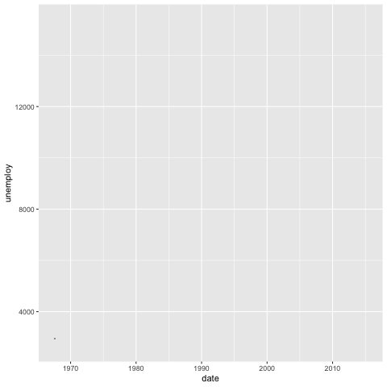
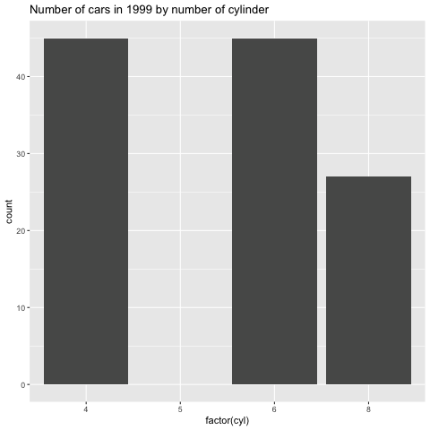
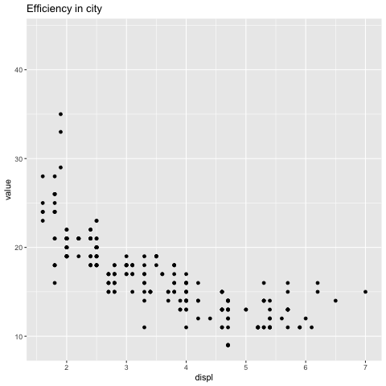

## online doc

http://exts.ggplot2.tidyverse.org

## plot Composition

### many approaches
- facet hacking
- gridExtra::grid.arrange()
- ggpubr::ggarrange()
- cowplot::plot_grid()
- patchwork

```{r}
install.packages('patchwork')
require(patchwork)
library(datasets)
?msleep

library(ggplot2)

p1 <- ggplot(msleep) +
  geom_boxplot(aes(x=sleep_total,
                    y=vore,
                    fill=vore))

p2 <- ggplot(msleep) +
  geom_bar(aes(y=vore,
               fill=vore))


p3 <- ggplot(msleep) +
  geom_point(aes(x=bodywt,
                 y=sleep_total,
                 colour=vore)) +
  scale_x_log10()

# messy?
p1 + p2 + p3

# customize layout
# "|" means side by side
# "/" means next row in canvas
(p1 | p2) / p3

p_all <- (p1 | p2) / p3
p_all +
  plot_layout(
    guides = 'collect'
  )

# more "operators"
# "&" means add ggplot layers to patchwork

p_all &
  theme(
    legend.position = 'none'
  )

p_all + 
  plot_annotation(
    title = 'Mammal sleep patterns',
    tag_levels = 'A'
  ) &
  theme(
    legend.position = 'none'
  )

```
## Excercises

patchwork will assign the same amount of space to each plot by default, but this can be controlled with the `widths` and `heights` argument in `plot_layout()`

syntax
- `plot_layout(heights=c(w1,w2,w3,...))`

- `plot_layout(widths=unit(c(5,1,1), c('cm', 'null', 'null')))`

```{r}

library(ggplot2)
library(patchwork)
library(datasets)

p <- ggplot(mtcars) +
  geom_point(aes(x=disp,
                 y=mpg))

p + p + p +
  plot_layout(widths=c(1,2,1))

```


patchwork contains many features for fine tuning the layouts and annotation. very complex layouts can be obtained by providing a `design` argument in `plot_layout`.

```{r}

p1 <- ggplot(mtcars) +
  geom_point(aes(x=disp,
                 y=mpg))

p2 <- ggplot(mtcars) +
  geom_bar(aes(x=factor(gear)))

p3 <- ggplot(mtcars) +
  geom_boxplot(aes(x=factor(gear),
                   y=mpg))

layout <- '
AA#
#BB
C##
'

# patchwork::area(1, 1, 1, 2)
# or

p1 + p2 + p3 +
  plot_layout(design = layout)

```

## dataset::luv_colours

```{r}
ggplot(ggplot2::luv_colours) +
  geom_point(mapping = aes(x=u,
                           y=v)) +
  theme_bw()

```

## ggplot Animation

- story telling and attention grabbing

- may turn boring people off(some valid critique)

- our eys are drawn to movement and our mind think in motion

- many ways to make animations -- gganimate may be the only one doing it the "grammar" way

```{r}

ggplot(economics) +
  geom_line(aes(x=date,
                y=unemploy))
```
animated

```{r message = FALSE, warning = FALSE, results = FALSE}

library('gganimate')
#install.packages('gifski')
#install.packages('av')
g <- ggplot(economics) +
  geom_line(aes(x=date,
                y=unemploy)) +
  transition_reveal(along=date)

anim_save('economics.gif', g,
          renderer=gifski_renderer())

```



### another example

```{r message=FALSE, warning=FALSE, results=FALSE}

g <- ggplot(mpg) +
  geom_bar(aes(x=factor(cyl))) +
  labs(title='Number of cars in {closest_state} by number of cylinder') +
  transition_states(states=year) +
  enter_grow() +
  exit_fade()

anim_save('mpg.gif', g, renderer=gifski_renderer())

```


```{r message=FALSE, warning=FALSE, results=FALSE}

library(tidyverse)

mpg2 <- tidyr::pivot_longer(mpg,
                            c(cty,hwy))


g <- ggplot(mpg2) +
  geom_point(aes(x=displ,
                 y=value)) +
  ggtitle("{if (closest_state == 'cty')
          'Efficiency in city' else 'Efficiency on highway'}") +
  transition_states(name) +
  ease_aes(y='cubic-in-out')

anim_save('mpg2.gif', g, renderer=gifski_renderer())


```



## Annotation

- you can't tell story w/o words
- this has often been relegated to post processing in e.g. Adobe Illustrator
- recent improvements means that most can be done with code

- two key packages:
  - ggrepel
  - ggforce


```{r}

# install.packages('ggrepel')
library(ggrepel)

ggplot(mtcars, aes(x=disp,
                 y=mpg)) +
  geom_point() +
  ggrepel::geom_text_repel(
    aes(label=row.names(mtcars))
  )


```

```{r message=FALSE, warning=FALSE, results=FALSE}

# install.packages('ggforce')
library(ggforce)

ggplot(mtcars, aes(x=disp, y=mpg)) +
  geom_point() +
  geom_mark_ellipse(
    aes(filter=gear==4,
        label='4 gear cars',
        description='Cars with fewer gears tend to both have higher yield and lower displacement')
  )

```
 
 
 ### more...
 
 ```{r}
 
 install.packages('concaveman')
 library(concaveman)
 
 ggplot(mtcars, aes(x=disp, y=mpg)) +
   geom_point() +
   geom_mark_hull(aes(fill=factor(gear)))
 
 ```

## network

- ggplot2 was built for tabular data

an API decision, not a grammer constraint

- multiple packages try to add network capabilities to ggplot2

* GGally
* ggnetwork
* geomnet
* ggtree
* ggdag
* ggraph

 
```{r}

library(ggraph)
library(tidygraph)

g <- create_notable('zachary') %>%
  mutate(clique=as.factor(group_infomap()))

ggraph(g) +
  geom_edge_link() +
  geom_node_point(aes(colour=clique),
                  size=2)


```


## looks

theming is one of the (programmatically) easiest things to extend

lots of options:
ggthemes
tvthemes
ggtech
ggthemr
hrbrthemes

often coupled with colour scales

don't go too crazy unless warranted

```{r}

library(hrbrthemes)

p <- ggplot(mtcar) +
  geom_point(aes()) +
  labs(x='fuel effeciency (mpg)',
       y='weight (tons)',
       title='seminal ggplot2 example',
       subtitle='a plot to show off different thems',
       caption='source: it is mtcars - everyone uses it')

p +
  scale_colour_ipsum() +
  theme_ipsum()


```


## Thinking in grammer

grammer of graphics is not just for constructing graphs - use it to deconstruct as well!

the grammer is ambiguous and that's okey

if all else fails:
everything is just points, line, polygons, and text
if faceting fails, use patchwork
illustrator is ok

```{r}

anscombe

```
