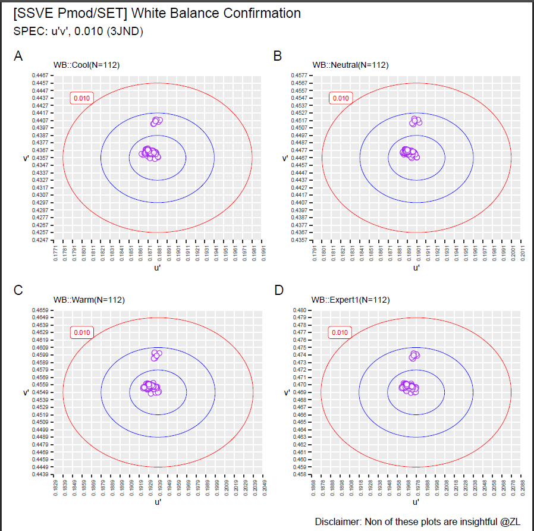

# SSVE White Balance Data Visualization

20 Dec 2021, SSVE started a trial which is an activity to write White Balance data into Pmod T-Con board.

To ensure effectiveness, PE wanna check log data compared with JND.

This probject provides two solutions as follows:

## Solution 01: `VBA` + `Excel`

Sample: N < 1,000

Toolkits:

1. using `VBA` for data wrangling;
2. using `Excel` for data visualization;

Usage: to confirm production samples or OQC samples.

demerits: `Excel` performance becomes poor when datasets are bigger than 1,000;

## Solution 02: `Python` + `Rlang`

Sample: N >= 1,000

Toolkits:

1. using `Python3` + `Pandas` for data wrangling
2. using `Rlang` + `ggplot2` for data Visualization

(it is rather common in Data Scientist and industry)

Usage: to confirm enormous data samples(N > 100,000,000) from SSVE production to achieve peak performance.

## Author

SSVE TVQA member `@Zhang Liang`, 20211220

## Changelog

- v0.01, initial build
- v0.02, fix visualization bug (screw non-standard charts..)
- v0.03, resize `named range` dynamically
- v0.04, create `Python3` + `Rlang` solution for scaling data and workload;
- v0.05, builder pipeline to dump all data into database

## Diagram

the following the diagram of the whole process


# Solution 01 

toolkits: `VB.NET` + `Excel` + `VBA`;

using this approach when workload and dataset are small (<= 1,000);

## Implementation

some core functionality as follows.

```VB

Private Sub read_PBM_csv(ByVal csv_path As String, ByRef dstWB As Workbook)
    ''' read data from a PBM csv log files at SSVE @ZL, 20211220
    cool = Array(47, 58, 69, 80)
    neutral = Array(107, 118, 129, 140)
    warm = Array(167, 178, 189, 200)
    expert1 = Array(227, 238, 249, 260)
    
    color_temps = Array(cool, neutral, warm, expert1)
    
    For i = lb To ub
        dstRow = GetLastRow(dstWS_cool, dstCol_u) + 1
        dstWS_cool.Cells(dstRow, dstCol_ser).Value = dstWS_cool.Cells(dstRow, dstCol_ser).Value & parse_pbm_fp(csv_path)
        dstWS_cool.Cells(dstRow, dstCol_u).Resize(1, 2) = ConvXY_to_uv(src_ws.Cells(cool(i), col_x), src_ws.Cells(cool(i), col_y))                ' cool
        
        dstWS_neutral.Cells(dstRow, dstCol_ser).Value = dstWS_neutral.Cells(dstRow, dstCol_ser).Value & parse_pbm_fp(csv_path)
        dstWS_neutral.Cells(dstRow, dstCol_u).Resize(1, 2) = ConvXY_to_uv(src_ws.Cells(neutral(i), col_x), src_ws.Cells(neutral(i), col_y))    ' neutral
        
        dstWS_warm.Cells(dstRow, dstCol_ser).Value = dstWS_warm.Cells(dstRow, dstCol_ser).Value & parse_pbm_fp(csv_path)
        dstWS_warm.Cells(dstRow, dstCol_u).Resize(1, 2) = ConvXY_to_uv(src_ws.Cells(warm(i), col_x), src_ws.Cells(warm(i), col_y))           ' warm
        
        dstWS_expert1.Cells(dstRow, dstCol_ser).Value = dstWS_expert1.Cells(dstRow, dstCol_ser).Value & parse_pbm_fp(csv_path)
        dstWS_expert1.Cells(dstRow, dstCol_u).Resize(1, 2) = ConvXY_to_uv(src_ws.Cells(expert1(i), col_x), src_ws.Cells(expert1(i), col_y))  ' expert1
    Next i
    
    src_wb.Close False
    Set src_wb = Nothing
End Sub

```

## Visualization

using some tricks to make dynamic charts.

### Dynamic Chart

```VB

''' Dynamic Chart
' [ trick ]
' step1: using Formula -> Define Name to cusomize target series + offset() function
' step2: using Click Chart -> select data series -> target series

' ref: https://support.microsoft.com/en-us/office/offset-function-c8de19ae-dd79-4b9b-a14e-b4d906d11b66
' syntax: OFFSET(reference, rows, cols, [height], [width])

```


### Gallary


# Solution 02

toolkits: `Python3` + `Pandas` + `Rlang` + `ggplot2`;

using this approach when workload and dataset are enormous (>=1,000);

## Implementation

```Python

def main()->None:
    root:Path    = './src'
    pfs          = PBM_FileStruct()
    holder       = Holder()
    offset:float = .0
    
    pw = PBM_Wrangler(pfs, root, holder, offset)
    pw.work('./data/wb.db', 'wb')

```

## Visualization

```R

### plot
plot.wb <- function(df.temp, temp,
                    temp.breaks.x, temp.breaks.y,
                    temp.minor.x, temp.minor.y, 
                    temp.jnd1, temp.jnd2, temp.jnd3) {
  
  p <- ggplot(df.temp) +
    geom_point(aes(x=u,
                   y=v),
               colour="purple",
               shape=21,
               fill='white',
               stroke=.5,
               alpha=.8,
               size=2) +
    #  coord_cartesian(xlim=c(0.1771, 0.1991),
    #                  ylim=c(0.4247, 0.4467)) +
    scale_x_continuous(breaks = temp.breaks.x,
                       minor_breaks = temp.minor.x) +
    scale_y_continuous(breaks = temp.breaks.y,
                       minor_breaks = temp.minor.y) +
    labs(title=gsub(' ', '', paste('WB::',
                                   temp, 
                                   '(N=',
                                   length(df.temp$u),
                                   ')')),
         x="u\'",
         y="v\'") +
    annotate(geom='label',
             x=min(temp.jnd3$du)+0.002,
             y=max(temp.jnd3$dv)-0.002,
             label='0.010',
             colour='red',
             size=2) +
    theme(plot.title = element_text(size=8),
          #panel.grid.major.x = element_blank(),
          #panel.grid.major.y = element_blank(),
          panel.grid.minor.x = element_blank(),
          panel.grid.minor.y = element_blank(),
          axis.title.x = element_text(size=8),
          axis.title.y = element_text(angle=0, size=8, vjust=0.5),
          axis.text.x = element_text(angle=90, size=5),
          axis.text.y = element_text(size=5)) +
    geom_path(data=temp.jnd1,
              aes(x=du,
                  y=dv),
              size = 0.2,
              color = 'blue'
    ) +
    geom_path(data=temp.jnd2,
              aes(x=du,
                  y=dv),
              size = 0.2,
              color = 'blue'
    ) +
    geom_path(data=temp.jnd3,
              aes(x=du,
                  y=dv),
              size = 0.2,
              color = 'red'
    )
  return(p)
}

```

### Gallary



## About

MIT License

Copyright (c) 2021 ZL

Permission is hereby granted, free of charge, to any person obtaining a copy
of this software and associated documentation files (the "Software"), to deal
in the Software without restriction, including without limitation the rights
to use, copy, modify, merge, publish, distribute, sublicense, and/or sell
copies of the Software, and to permit persons to whom the Software is
furnished to do so, subject to the following conditions:

The above copyright notice and this permission notice shall be included in all
copies or substantial portions of the Software.

THE SOFTWARE IS PROVIDED "AS IS", WITHOUT WARRANTY OF ANY KIND, EXPRESS OR
IMPLIED, INCLUDING BUT NOT LIMITED TO THE WARRANTIES OF MERCHANTABILITY,
FITNESS FOR A PARTICULAR PURPOSE AND NONINFRINGEMENT. IN NO EVENT SHALL THE
AUTHORS OR COPYRIGHT HOLDERS BE LIABLE FOR ANY CLAIM, DAMAGES OR OTHER
LIABILITY, WHETHER IN AN ACTION OF CONTRACT, TORT OR OTHERWISE, ARISING FROM,
OUT OF OR IN CONNECTION WITH THE SOFTWARE OR THE USE OR OTHER DEALINGS IN THE
SOFTWARE.
