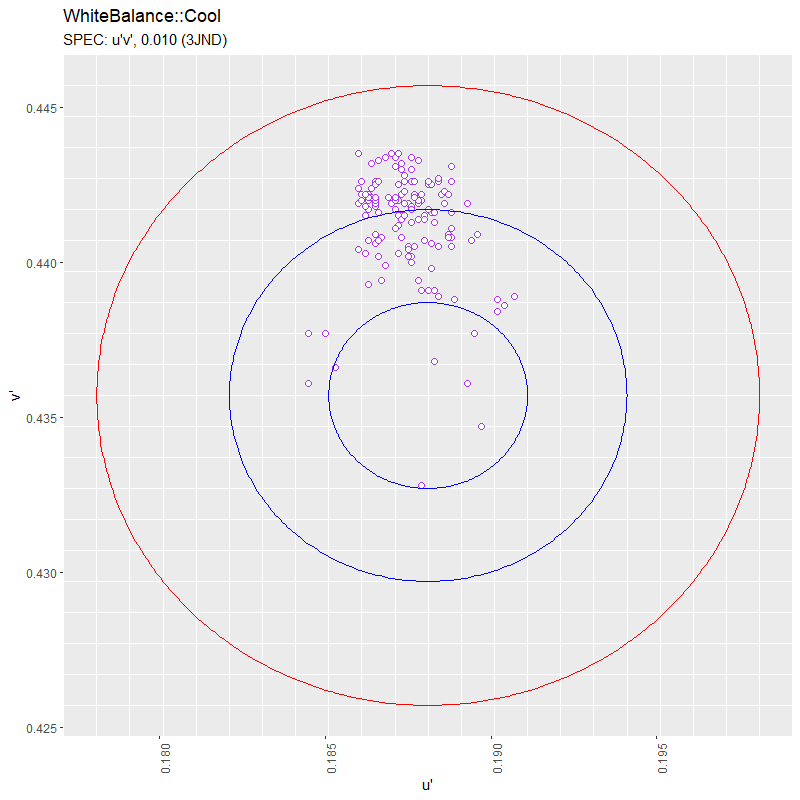
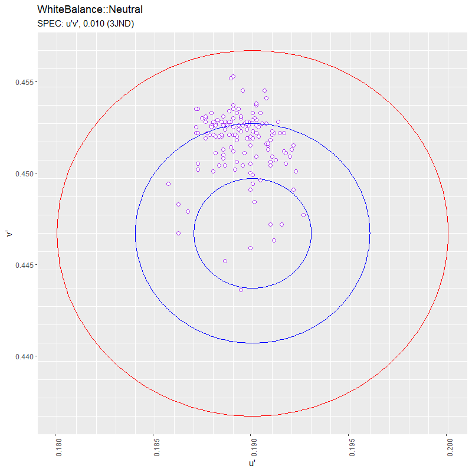
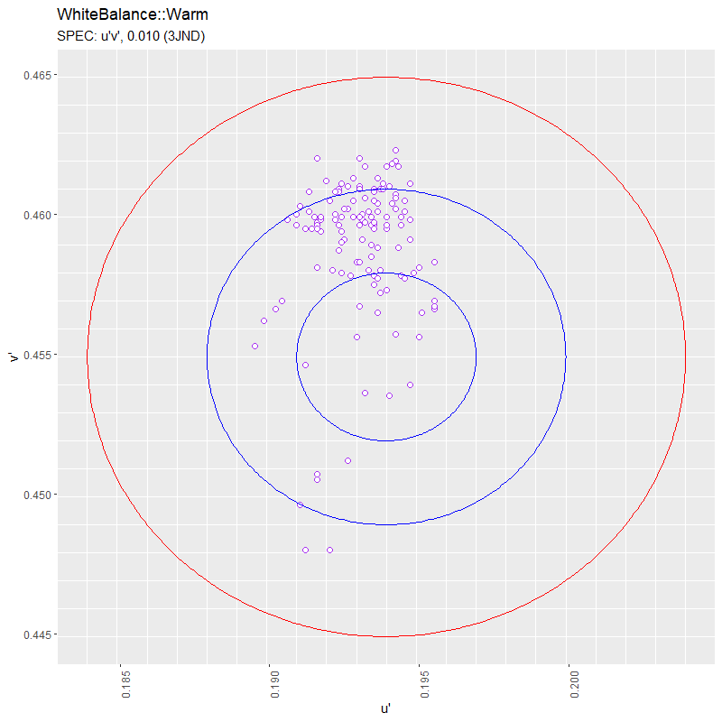
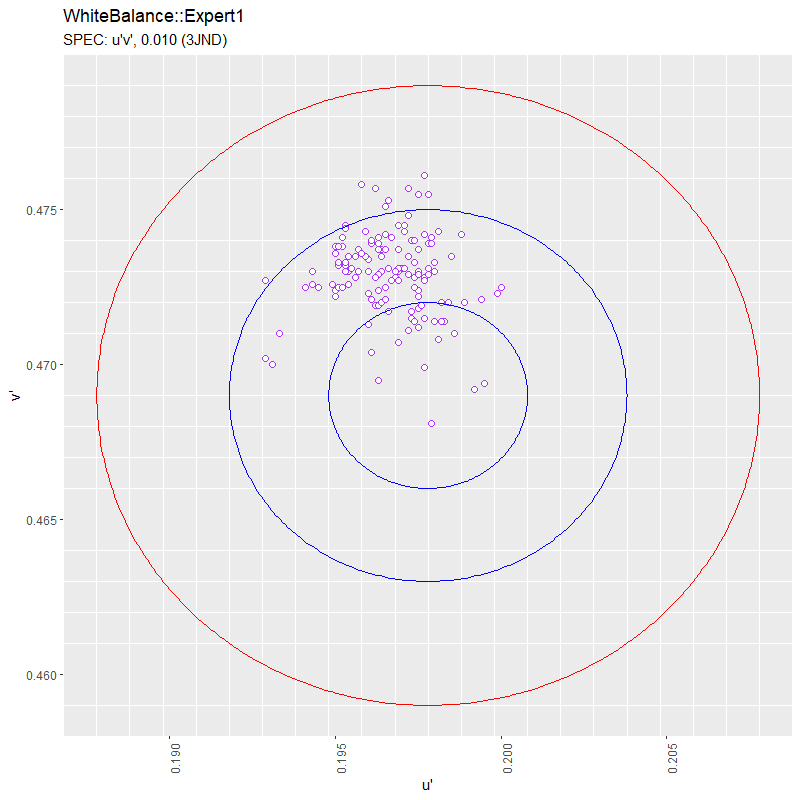

# SSVE White Balance Data Visualization

20 Dec 2021, SSVE started a trial which is an activity to write White Balance data into Pmod T-Con board.

To ensure effectiveness, PE wanna check log data compared with JND.

This small VBA project helps to accelerate the whole process.

## Author

SSVE TVQA member `@Zhang Liang`, 20211220

## Changelog

- v0.01, initial build
- v0.02, fix visualization bug (screw non-standard charts..)
- v0.03, resize `named range` dynamically
- v0.04, create `Python3 + Rlang` solution for scaling data and workload;

## Diagram

the following the diagram of the whole process


# Solution 01 

toolkits: `VB.NET` + `Excel` + `VBA`;

using this approach when workload and dataset are small (<= 1,000);

## Implementation

some core functionality as follows.

```VB

Private Sub read_PBM_csv(ByVal csv_path As String, ByRef dstWB As Workbook)
    ''' read data from a PBM csv log files at SSVE @ZL, 20211220
    Const col_x As Integer = 5
    Const col_y As Integer = 6
    Const idx_x As Integer = 0
    Const idx_y As Integer = 1
    Const sheet_no As Integer = 1
    Dim cool, neutral, warm, expert1, color_temps
    
    cool = Array(47, 58, 69, 80)
    neutral = Array(107, 118, 129, 140)
    warm = Array(167, 178, 189, 200)
    expert1 = Array(227, 238, 249, 260)
    
    color_temps = Array(cool, neutral, warm, expert1)
    
    Dim src_wb As Workbook
    Dim src_ws As Worksheet
    
    Set src_wb = GetObject(csv_path)
    Set src_ws = src_wb.Worksheets(sheet_no)

    Dim i As Integer
    Const wsn_cool As String = "Cool"
    Const wsn_neutral As String = "Neutral"
    Const wsn_warm As String = "Warm"
    Const wsn_expert1 As String = "Expert1"
    Dim dstWS_cool As Worksheet: Set dstWS_cool = dstWB.Sheets(wsn_cool)
    Dim dstWS_neutral As Worksheet: Set dstWS_neutral = dstWB.Sheets(wsn_neutral)
    Dim dstWS_warm As Worksheet: Set dstWS_warm = dstWB.Sheets(wsn_warm)
    Dim dstWS_expert1 As Worksheet: Set dstWS_expert1 = dstWB.Sheets(wsn_expert1)

    Const lb As Integer = 0
    Const ub As Integer = 3
    Dim dstRow As Integer
    Const dstCol_dt As Integer = 2
    Const dstCol_ser As Integer = 3
    Const dstCol_u As Integer = 7
    Const dstCol_v As Integer = 8

    For i = lb To ub
        dstRow = GetLastRow(dstWS_cool, dstCol_u) + 1
        dstWS_cool.Cells(dstRow, dstCol_ser).Value = dstWS_cool.Cells(dstRow, dstCol_ser).Value & parse_pbm_fp(csv_path)
        dstWS_cool.Cells(dstRow, dstCol_u).Resize(1, 2) = ConvXY_to_uv(src_ws.Cells(cool(i), col_x), src_ws.Cells(cool(i), col_y))                ' cool
        
        dstWS_neutral.Cells(dstRow, dstCol_ser).Value = dstWS_neutral.Cells(dstRow, dstCol_ser).Value & parse_pbm_fp(csv_path)
        dstWS_neutral.Cells(dstRow, dstCol_u).Resize(1, 2) = ConvXY_to_uv(src_ws.Cells(neutral(i), col_x), src_ws.Cells(neutral(i), col_y))    ' neutral
        
        dstWS_warm.Cells(dstRow, dstCol_ser).Value = dstWS_warm.Cells(dstRow, dstCol_ser).Value & parse_pbm_fp(csv_path)
        dstWS_warm.Cells(dstRow, dstCol_u).Resize(1, 2) = ConvXY_to_uv(src_ws.Cells(warm(i), col_x), src_ws.Cells(warm(i), col_y))           ' warm
        
        dstWS_expert1.Cells(dstRow, dstCol_ser).Value = dstWS_expert1.Cells(dstRow, dstCol_ser).Value & parse_pbm_fp(csv_path)
        dstWS_expert1.Cells(dstRow, dstCol_u).Resize(1, 2) = ConvXY_to_uv(src_ws.Cells(expert1(i), col_x), src_ws.Cells(expert1(i), col_y))  ' expert1
    Next i
    
    src_wb.Close False
    Set src_wb = Nothing
End Sub

```

## Visualization

using some tricks to make dynamic charts.

### Dynamic Chart

```VB

''' Dynamic Chart
' [ trick ]
' step1: using Formula -> Define Name to cusomize target series + offset() function
' step2: using Click Chart -> select data series -> target series

' ref: https://support.microsoft.com/en-us/office/offset-function-c8de19ae-dd79-4b9b-a14e-b4d906d11b66
' syntax: OFFSET(reference, rows, cols, [height], [width])

```


### Gallary


# Solution 02

toolkits: `Python3` + `Pandas` + `Rlang` + `ggplot2`;

using this approach when workload and dataset are enormous (>=1,000);

## Implementation

```Python

class PBM_Wrangler:
    def __init__(self, src_folder:Path) -> None:
        self._src_folder = src_folder

    def _filter(self)->Path:
        for path in sorted(pathlib.Path(self._src_folder).glob(f'*.{self.fn_ext}')):
            if path.name.startswith(self.fn_prefix):
                yield path.absolute()

    def __read(self)->None:
        for pbm_file in self._filter():
            df:DataFrame = pd.read_csv(pbm_file, skiprows=self.dummy_rows, engine='python')
            df[self.head_picmode] = self.temps
            self.df_temp = df[np.isin(df[self.head_level], self.ires)]

    def __categorize(self, color_temp:str, dst_df:List[DataFrame])->None:
        df:DataFrame = self.df_temp[self.df_temp[self.head_picmode] == color_temp].loc[:, [self.head_x, self.head_y]]
        df[self.head_u] = df.apply(lambda x: self.xy2u(x[self.head_x], x[self.head_y]), axis=1)
        df[self.head_v] = df.apply(lambda x: self.xy2v(x[self.head_x], x[self.head_y]), axis=1)
        fixed_df = df.loc[:, self.head_uv]
        dst_df.append(fixed_df)
    
    def __wrangle(self)->None:
        self.__categorize('COOL', self.df_cools)
        self.__categorize('NEUTRAL', self.df_neutrals)
        self.__categorize('WARM', self.df_warms)
        self.__categorize('EXPERT1', self.df_expert1s)

    def __concat(self, color_temp:str, src_df:List[DataFrame])->None:
        df:DataFrame = pd.concat(src_df, ignore_index=True, sort=False)
        df.to_csv(f'./src/{color_temp}.csv', index=False)

    def __tocsv(self)->None:
        self.__concat('COOL', self.df_cools)
        self.__concat('NEUTRAL', self.df_neutrals)
        self.__concat('WARM', self.df_warms)
        self.__concat('EXPERT1', self.df_expert1s)
        
    @timer
    def work(self)->None:
        logging.info('start working..')
        self.__read()
        self.__wrangle()
        self.__tocsv()
        logging.info('successed.')

```

## Visualization

```R

### plot
plot.wb <- function(df.temp, temp, temp.minor.x, temp.minor.y, temp.jnd1, temp.jnd2, temp.jnd3) {
  ggplot(df.temp) +
    geom_point(aes(x=u,
                   y=v),
               colour = "purple",
               shape = 21,
               fill = 'white',
               stroke = .5,
               alpha = 0.9,
               size = 2) +
  #  coord_cartesian(xlim=c(0.1771, 0.1991),
  #                  ylim=c(0.4247, 0.4467)) +
    scale_x_continuous(minor_breaks = temp.minor.x) +
    scale_y_continuous(minor_breaks = temp.minor.y) +
    labs(title=paste('White Balance, ', temp),
         subtitle = "SPEC: u\'v\', 0.010(3JND)",
         x="u\'",
         y="v\'") +
    theme(panel.grid.major.x = element_blank(),
          panel.grid.major.y = element_blank(),
          axis.text.x = element_text(angle=90)) +
    geom_path(data=temp.jnd1,
               aes(x=du,
                   y=dv),
               size = 0.2,
               color = 'blue'
               ) +
    geom_path(data=temp.jnd2,
               aes(x=du,
                   y=dv),
               size = 0.2,
               color = 'blue'
    ) +
    geom_path(data=temp.jnd3,
               aes(x=du,
                   y=dv),
               size = 0.2,
               color = 'red'
    )
}

```

### Gallary






## About

MIT License

Copyright (c) 2021 ZL

Permission is hereby granted, free of charge, to any person obtaining a copy
of this software and associated documentation files (the "Software"), to deal
in the Software without restriction, including without limitation the rights
to use, copy, modify, merge, publish, distribute, sublicense, and/or sell
copies of the Software, and to permit persons to whom the Software is
furnished to do so, subject to the following conditions:

The above copyright notice and this permission notice shall be included in all
copies or substantial portions of the Software.

THE SOFTWARE IS PROVIDED "AS IS", WITHOUT WARRANTY OF ANY KIND, EXPRESS OR
IMPLIED, INCLUDING BUT NOT LIMITED TO THE WARRANTIES OF MERCHANTABILITY,
FITNESS FOR A PARTICULAR PURPOSE AND NONINFRINGEMENT. IN NO EVENT SHALL THE
AUTHORS OR COPYRIGHT HOLDERS BE LIABLE FOR ANY CLAIM, DAMAGES OR OTHER
LIABILITY, WHETHER IN AN ACTION OF CONTRACT, TORT OR OTHERWISE, ARISING FROM,
OUT OF OR IN CONNECTION WITH THE SOFTWARE OR THE USE OR OTHER DEALINGS IN THE
SOFTWARE.
